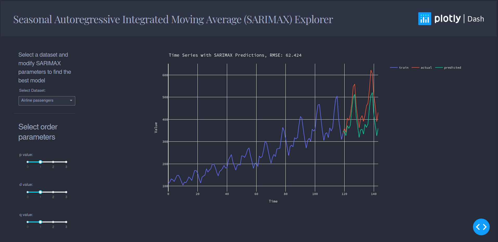

# SARIMAX_Dashboard

Link to dashboard is available [here](https://HoldenRuegger.pythonanywhere.com)
This dashboard is written in plotly/Dash and is supposed to be a demonstration of Seasonal Autoregressive Integrated Moving Average (SARIMAX)
models for predicting time series values. Users can choose from 3 different datasets and change the order paramaters
and seasonal order parameters to fit a new model and see how well the model predicts the values. Please be patient when using as 
some of the parameter changes will cause the model to take longer to train.

## Sample screenshot  

